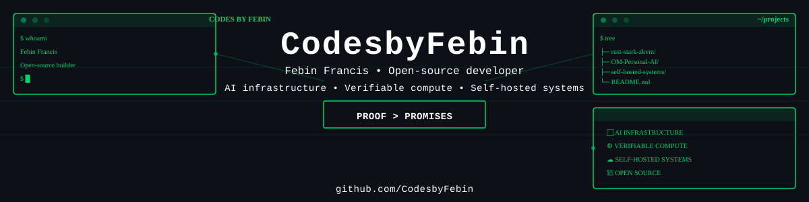
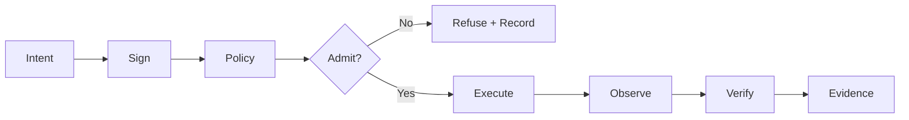

<div align="center">

[Portfolio](https://codesbyfebin.github.io/) · [Projects](https://codesbyfebin.github.io/portfolio.html) · [DEV articles](https://dev.to/codesbyfebin) · [Bluesky](https://bsky.app/profile/codesbyfebin.bsky.social) · [LinkedIn](https://www.linkedin.com/in/codes-by-febin/)

</div>

## Hi, I'm Febin 👋

I'm an open-source builder from **Kerala, India**, working on AI infrastructure, verifiable computation and systems you can run yourself. I share code, debugging lessons and the trade-offs behind the design.

**Start exploring:** [STARK computation in Rust](https://github.com/CodesbyFebin/rust-stark-zkvm) · [Self-hosted infrastructure](https://github.com/CodesbyFebin/Decentralized-) · [OM Personal AI](https://github.com/CodesbyFebin/-Om-Personal-Ai)

**Follow the work:** [Read practical build notes on DEV](https://dev.to/codesbyfebin) or [connect on Bluesky](https://bsky.app/profile/codesbyfebin.bsky.social).

Project capabilities evolve. Inspect each repository's source, tests and limitations for current implementation status.

---

<div align="center">

# FEBIN FRANCIS

### Systems Engineer · AI Infrastructure · Verifiable Compute

**Building systems that prove what happened instead of asking you to trust what happened.**

`AI Agents` · `Sovereign AI` · `MCP` · `Local LLMs` · `Zero-Knowledge` · `Distributed Systems`

[Portfolio](https://codesbyfebin.github.io/) · [LinkedIn](https://www.linkedin.com/in/codes-by-febin/) · [ORCID](https://orcid.org/0009-0002-8123-1531)

</div>

---

## WHO THIS IS FOR

| You are... | I build... | Let's talk about... |
|---|---|---|
| **AI Product Teams** | Agentic infrastructure with explicit policies, permissions and contracts | Scaling agents safely with audit trails and proof of execution |
| **Security/Compliance** | Sovereign systems where the host retains admission authority | Local policy enforcement, attestation, and verifiable computation |
| **Infrastructure Teams** | Distributed systems with explicit desired/admitted/observed/verified states | Chaos testing, conformance verification, and sealed state contracts |
| **Open Source Contributors** | MCP servers and agent skills with machine-readable contracts | Building reusable, testable, evidence-first infrastructure components |

---

---

## CREDIBILITY SIGNALS

- **5+ production-grade systems** spanning cryptography, distributed systems, and AI infrastructure
- **Open source contributor** to Winterfell (STARKs), MCP ecosystem, and verifiable compute
- **Published work** on ORCID ([0009-0002-8123-1531](https://orcid.org/0009-0002-8123-1531)) and linked via peer-reviewed indexing
- **Evidence-first approach** — all capability claims backed by source, tests, specifications, and executable verification
- **Professional network** in systems engineering, AI infrastructure, and zero-knowledge cryptography

---

## SYSTEM PROFILE

```text
ENGINEER       Febin Francis
HANDLE         CodesbyFebin
FOCUS          AI Infrastructure · Verifiable Compute · Sovereign Systems
BUILDS         Agents · runtimes · protocols · control planes · proof systems
PRINCIPLE      Measure → Verify → Admit → Execute → Prove
UNMEASURED     UNKNOWN
```

I design infrastructure around **signed intent, local policy, explicit execution state, evidence, and reproducible verification**.

**Core commitments:**
- If a capability is simulated, it says **SIMULATED**
- If it has not been measured, it says **UNKNOWN**  
- If it cannot pass the gate, it does not silently pass
- Claims are backed by source code, tests, specifications, and independent verification artifacts

## WHAT I BUILD

| Domain | Business Problem | Engineering Solution | Proof Points |
|---|---|---|---|
| **Agentic Infrastructure** | How do you scale AI agents safely? Who audits tool use? | Agents with explicit policies, MCP contracts, machine-readable permissions, audit trails | rust-stark-zkvm proof gates; MCP tool gateways; permission models |
| **Sovereign Infrastructure** | How do you own your infrastructure? Can you fork it? | Operator retains admission authority; signed intent; host-local policies; no central gate | Decentralized.Host Ed25519 signing; per-node policy; mTLS + WireGuard |
| **Verifiable Compute** | Can you prove computation happened correctly? Without audits? | Execution claims checkable by independent verifiers; mathematical proof instead of trust | rust-stark-zkvm STARK proofs; Winterfell integration; CI proof gates |
| **Distributed Systems** | What's actually running vs what should be running? | Explicit desired/admitted/executing/observed/verified states; never collapsed | Decentralized.Host state separation; chaos testing; conformance verification |

## SELECTED SYSTEMS

### [rust-stark-zkvm](https://github.com/CodesbyFebin/rust-stark-zkvm) · Rust

> **Verifiable execution at the protocol layer.** A zero-knowledge VM where computation claims can be independently checked without trusting the prover.

**Use case**: Build applications that prove correctness without audits or trust assumptions.

- Custom ISA (ADD/SUB/MUL/JZ/JNZ) with fixed register architecture
- Winterfell STARK prover/verifier (production-grade cryptography)
- HTTP API for remote proving and verification
- MCP integration for agent-native proof workflows
- CI-gated proof verification (catches breaking changes)
- Honest mock stubs that don't pretend to be real

**Why it matters**: Moves the verification boundary from trust to mathematics. Every claim is independently checkable.

### [Decentralized.Host](https://github.com/CodesbyFebin/Decentralized-) · Go

> **Infrastructure where operators stay in control.** A distributed system that separates desired state, admitted state, observed state, and verified state — each inspectable, never collapsed.

**Use case**: Self-hosted multi-node clusters where security policy lives on each host.

- Ed25519 signed intent (cryptographic accountability)
- Per-host admission gates (local policy enforcement, not central)
- Explicit desired/admitted/observed/verified state (audit trail by design)
- BLAKE3 content-addressed storage with Merkle trees (tamper-proof)
- Raft consensus + mTLS encryption
- Userspace WireGuard overlay networking
- Chaos & conformance testing (not just happy-path)
- Published `dh/v1` specification with verification artifacts

**Why it matters**: Every node knows what it authorized, what it executed, and what it observed. Compliance comes from architecture, not checkboxes.

### [decentralized.hosting](https://github.com/CodesbyFebin/decentralized.hosting) · Python

> **A working deployment mesh.** Runnable Phase 1–2 implementation of self-hosted infrastructure with scheduling, rollback, local registry, and live edge routing.

**Use case**: Teams building their own deployment infrastructure without vendor lock-in.

Architecture: FastAPI Control Plane → Intelligent Scheduler → Docker Node Agents → Traefik Edge Routing → Your Workloads

Includes:
- Resource-aware scheduling (CPU/memory/constraints)
- Rollback and state recovery
- Local container registry
- Traefik edge routing with automatic cert management
- MCP integration for infrastructure automation
- Phase 1–2 features fully implemented; later roadmap phases kept separate

**Why it matters**: Deployment automation you control, audit, and can fork. No proprietary state.

### [XFree](https://www.xfree.in) · TypeScript

> **Developer and AI tools in the browser.** Fast, indexable, SEO-friendly tooling for developers who want to work in the open.

**Use case**: Teams building with React, TypeScript, and AI integrations who need quick, shareable tools.

Live stack: **React 19 · TypeScript · Vite 6 · Express 4**, with prerendered discovery surfaces and server-side AI gateways.

Live/published capabilities clearly separated from draft/experimental features.

**Why it matters**: Proves that browser-native tooling can be production-grade, discoverable, and AI-ready.

## ENGINEERING MODEL



```text
DESIRED ≠ ADMITTED ≠ EXECUTING ≠ OBSERVED ≠ VERIFIED
```

Collapsing these states into one green `SUCCESS` badge hides information that should remain inspectable.

## TOOLCHAIN

**Languages**  
Rust · Go · TypeScript · Python · Shell

**Infrastructure & cryptography**  
Winterfell · Raft · BLAKE3 · Ed25519 · WireGuard · Docker · Traefik · FastAPI · MCP

**Quality & verification**  
CodeQL · Playwright · Dependabot · conformance tests · chaos tests · proof gates

## INVARIANTS

```text
FAIL_CLOSED       Unsupported or unverifiable state must not silently become success
NO_FAKE_LIVE      Simulated capabilities stay visibly simulated
UNKNOWN ≠ HEALTHY Missing telemetry cannot become green status
LOCAL_AUTHORITY   The execution host retains admission authority
EVIDENCE > CLAIMS Tests, signatures and artifacts outrank prose
REPRODUCIBLE      Another implementation should be able to verify the contract
SOURCE = PRODUCT  Public capability claims should correspond to inspectable code
```

---

## GET IN TOUCH

### 🎯 **Let's work together**
- **Consulting**: AI infrastructure, verifiable compute, sovereign systems design
- **Hands-on collaboration**: Co-build agents, MCP servers, proof systems
- **Code review**: Architecture review, security analysis, implementation verification
- **Speaking/Writing**: AI infrastructure, agent systems, cryptographic proofs

📧 **Email**: [codesbyfebin@gmail.com](mailto:codesbyfebin@gmail.com)  
🔗 **LinkedIn**: [@codes-by-febin](https://www.linkedin.com/in/codes-by-febin/)  
💬 **GitHub Issues**: Open an issue on any repository to start a conversation

### 🔍 **Quick navigation**

| Interest | Start here |
|---|---|
| **Learn my approach** | [README](https://github.com/CodesbyFebin/CodesbyFebin#readme) (you're here) · [AGENTS.md](./AGENTS.md) |
| **See built systems** | [Portfolio](https://codesbyfebin.github.io/) · [rust-stark-zkvm](https://github.com/CodesbyFebin/rust-stark-zkvm) · [Decentralized.Host](https://github.com/CodesbyFebin/Decentralized-) |
| **Explore the stack** | [Technologies](#toolchain) · [Select systems](#selected-systems) |
| **Verify claims** | [AGENTS.md](./AGENTS.md) → Interpretation rules · [Evidence directory](./evidence) (when present) |
| **Collaborate** | Fork a repo · Open an issue · Email for serious discussions |

## DEVELOPER ECOSYSTEM

I build and document systems so they can be understood by **humans, coding agents, automation and external developer platforms** without inventing capabilities that are not present.

| Surface | Role in the engineering workflow |
|---|---|
| **GitHub** | Source, issues, pull requests, CI, security automation, evidence and release history |
| **MCP** | Explicit tool/resource boundary for AI agents and developer automation |
| **Agent Skills** | Reusable, scoped instructions for repeatable engineering workflows |
| **LinkedIn** | Professional identity and public project discovery |
| **Slack** | Team communication and developer collaboration when a workspace integration is configured |
| **Vercel** | Web/application deployment for applicable projects |
| **Docker** | Reproducible workload packaging and local/self-hosted execution |
| **Kubernetes** | Cluster orchestration where a project explicitly implements or validates it |
| **Local LLMs** | Operator-controlled inference paths for sovereign AI workflows |

### Agent-native repository contract

This profile follows the increasingly common separation between human documentation, agent instructions, compact LLM discovery and reusable skills:

```text
README.md
   ├── human technical profile
   ├── implemented systems
   └── verification links

AGENTS.md
   ├── agent operating rules
   ├── claim boundaries
   └── source-of-truth guidance

llms.txt
   ├── compact identity
   ├── project discovery
   └── verification entry points

SKILL.md / skills/
   ├── reusable engineering workflows
   └── evidence-first project inspection

agents.txt / agents.json
   └── machine-readable capability discovery
```

The repository does **not** treat the presence of an MCP server, skill file, social profile or deployment provider as proof of engineering capability. Those surfaces are interfaces. The underlying source, tests, specifications and evidence remain authoritative.

### Collaboration contract

**For technical collaboration:**
1. Start with the relevant repository and its issue/PR history
2. Review `AGENTS.md` and project-local instructions before proposing changes
3. Capability claims: verify against source, tests, specs, and executable evidence before repeating
4. Run the test suite and conformance checks before merging
5. Keep evidence artifacts (proofs, traces, logs) alongside code

**For professional engagement:**
- Public professional identity: [LinkedIn](https://www.linkedin.com/in/codes-by-febin/) · [ORCID](https://orcid.org/0009-0002-8123-1531)
- Project decisions driven by code and specifications, not Slack messages or prose
- Platform integrations (Slack, MCP, Email) are workflows, not canonical sources
- All capability claims backed by inspectable source or executable verification

**For AI agents or automation:**
- Read `AGENTS.md` for interpretation rules and claim boundaries
- Verify implementation against source before repeating claims
- Do not infer capabilities from profile surfaces; inspect source
- Use skills and MCP servers for repeatable workflows

## MACHINE INTERFACE

This profile and the selected repositories expose machine-readable context where available:

```text
README.md  → human orientation
AGENTS.md  → agent-readable project context
llms.txt   → machine-readable discovery
specs/     → normative contracts
evidence/  → verification artifacts
tests/     → executable claims
```

For programmatic interpretation, prefer repository-level `AGENTS.md`, `llms.txt`, specifications, tests and evidence over inferring capability from profile prose.

---

## NEXT STEPS

### 🎯 **Ready to collaborate?**

| You want to... | Do this |
|---|---|
| **Discuss a project** | Email [codesbyfebin@gmail.com](mailto:codesbyfebin@gmail.com) with context about your problem |
| **Explore the work** | Visit [Portfolio](https://codesbyfebin.github.io/) or pick a repo from [Selected Systems](#selected-systems) |
| **See the approach in action** | Review [rust-stark-zkvm](https://github.com/CodesbyFebin/rust-stark-zkvm) (complete proof cycle) or [Decentralized.Host](https://github.com/CodesbyFebin/Decentralized-) (distributed systems verification) |
| **Learn the philosophy** | Read [AGENTS.md](./AGENTS.md) and review the [Interpretation Rules](#developer-ecosystem) section |
| **Request a review** | Open an issue in any repository to start a conversation about architecture, security, or implementation |
| **Follow updates** | ⭐ Star repositories you find useful · 🔔 Watch for releases · 📧 Email for project announcements |
| **Connect professionally** | [LinkedIn](https://www.linkedin.com/in/codes-by-febin/) for hiring/partnership · [ORCID](https://orcid.org/0009-0002-8123-1531) for research collaboration |

### 🚀 **What I'm actively working on**
- **AI Infrastructure**: Scaling agents with explicit policies and machine-readable permission gates
- **Verifiable Compute**: Expanding proof system integrations beyond STARK for broader use cases
- **Sovereign Systems**: Building deployment meshes where operators retain full control
- **Open Source**: Contributing to MCP ecosystem and zero-knowledge tooling

**Interested in any of these?** [Let's talk.](mailto:codesbyfebin@gmail.com)

---

<div align="center">

## PROOF > PROMISES

**BUILD · MEASURE · VERIFY · IMPROVE**

**Get in touch:** [Email](mailto:codesbyfebin@gmail.com) · [LinkedIn](https://www.linkedin.com/in/codes-by-febin/) · [GitHub](https://github.com/CodesbyFebin) · [ORCID](https://orcid.org/0009-0002-8123-1531)

**See the work:** [Portfolio](https://codesbyfebin.github.io/) · [rust-stark-zkvm](https://github.com/CodesbyFebin/rust-stark-zkvm) · [Decentralized.Host](https://github.com/CodesbyFebin/Decentralized-)

</div>
